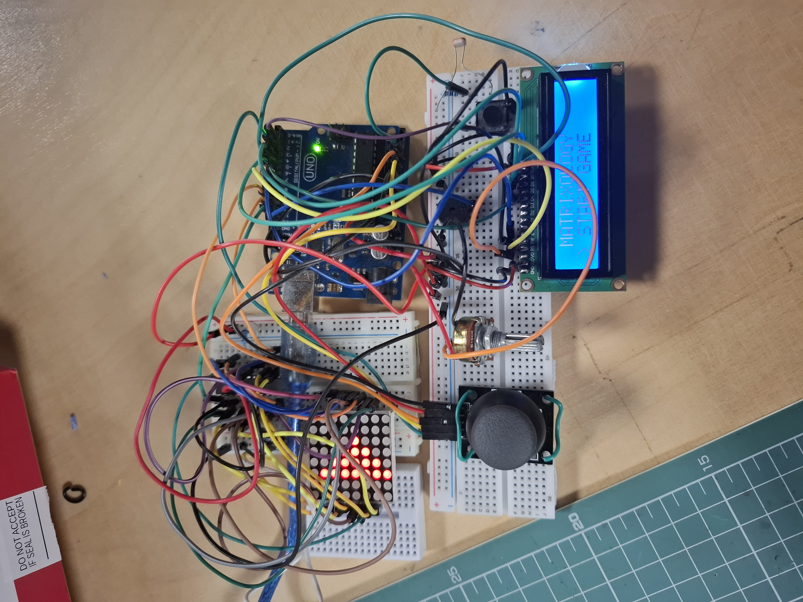

# 🟩 Matrixology

A roguelike dungeon crawler game for the 8x8 LED Matrix, built as part of the **Introduction to Robotics** course at the University of Bucharest (2025-2026).

## 📖 Introduction

A roguelike shooter where you navigate a 24x24 dungeon viewed through an 8x8 viewport. Shoot enemies, level up, and try to beat your high score. Covering the photoresistor triggers a burst attack — useful when surrounded.

## 🎮 Game Description

**Matrixology** is a top-down roguelike shooter where you navigate a randomly generated dungeon, fighting enemies and trying to achieve the highest score possible.

### Gameplay
- Shoot enemies to earn points (+10 per enemy)
- Level up at score thresholds (heals +2 HP, spawns more enemies)
- Game ends when health reaches 0

## 🕹️ How to Play

### Controls
| Action | Control |
|--------|---------|
| Move | Joystick (8 directions) |
| Shoot | Joystick BUTTON (short press) |
| Burst Attack | Cover the photoresistor (20s cooldown) |
| Return to menu | Joystick BUTTON (hold 1 second) or MENU button |

### Menu Options
1. **Start Game** — Begin a new run
2. **How to Play** — View control instructions
3. **High Scores** — View top 4 scores (hold button to reset)
4. **Settings** — Adjust threshold sensitivity and matrix brightness
5. **About** — Game credits and GitHub link
6. **Light Test** — Calibrate/test the photoresistor
7. **Draw Mode** — Free drawing on the matrix (extra feature)

## 📋 Task Requirements

### Menu (2p)
- ✅ Intro message with animation on startup
- ✅ Start Game option
- ✅ Shown details while playing (Lives, Score, Level, Ability cooldown)
- ✅ Screen upon game ending with score display
- ✅ Informs player when highscore is achieved
- ✅ Highscore: top 4 saved in EEPROM with score
- ⚠️ Highscore names not implemented (scores only)
- ⚠️ Enter name not implemented
- ✅ Settings: Matrix brightness control (saved to EEPROM)
- ⚠️ Settings: LCD brightness control not implemented
- ⚠️ Settings: Sound on/off not implemented
- ✅ Settings: Reset high scores button
- ✅ About: GitHub link, developer name, game name
- ✅ How to play: short description
- ✅ Different matrix icon for each menu category
- ✅ Sound when changing menu selection

### Game (3p)
- ✅ Uses LCD, Joystick, Buzzer, Sensor, LED Matrix
- ✅ Sound effects (movement, shooting, damage, level up, menu)
- ✅ 24x24 logical world with 8x8 viewport (fog of war)
- ✅ Progressive difficulty (more enemies per level)
- ✅ Sensor integration (photoresistor triggers burst attack)
- ✅ Reasonable game length
- ✅ Intuitive and fun gameplay

### Documentation (1.5p)
- ✅ Introduction / backstory
- ✅ Game description
- ✅ How to play instructions
- ✅ Used components
- ✅ Picture of setup
- ✅ Video demonstration

### Code (2p)
- ✅ Named constants (no magic numbers)
- ✅ Correct spacing and formatting
- ✅ Descriptive variable and function names
- ✅ State machine architecture

### Feeling (1.5p)
- ✅ Complete product feel
- ✅ Intuitive controls
- ✅ Fun gameplay loop

## 🖼️ Picture of the Setup

## 🎥 Video Demonstration

📺 **YouTube**: https://youtu.be/qyLYzwRygg0

## 🔧 Used Components

- Arduino Uno
- 8x8 LED Matrix (MAX7219)
- 16x2 LCD Display
- Joystick Module
- Photoresistor
- Passive Buzzer
- Push Button
- Resistors, breadboards, jumper wires